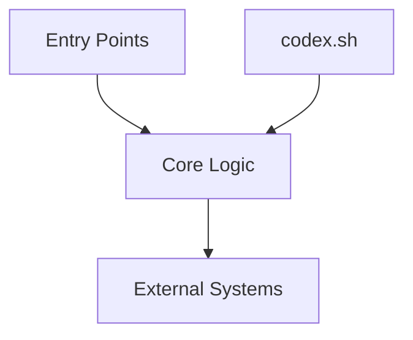

# Architecture Overview

```mermaid
flowchart TD
    A[Entry Points] --> B[Core Logic] --> C[External Systems]
    D[codex.sh] --> B
```
**Interfaces**: [key integration points]
**Critical paths**: [deployment, testing, release flows]
