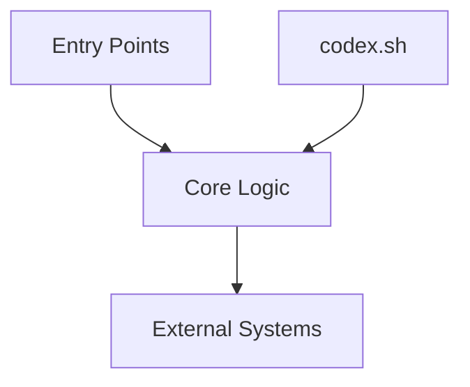

# Architecture Overview

**Interfaces**: `repo-harvest` and `finishes` CLI, filesystem, GitHub API
**Critical paths**: build (`cargo build`), testing (`cargo test`), release (`codex.sh bootstrap`)

**Interfaces**: [key integration points]
**Critical paths**: [deployment, testing, release flows]

