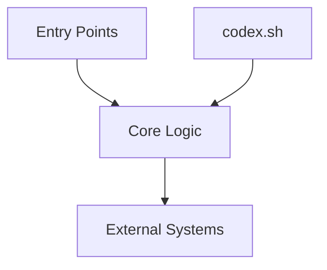

# Architecture Overview

**Interfaces**: `finishes` CLI, `repo-harvest` crate, filesystem, GitHub API
**Critical paths**: build (`cargo build`), testing (`cargo test`), release (`codex.sh bootstrap`)
